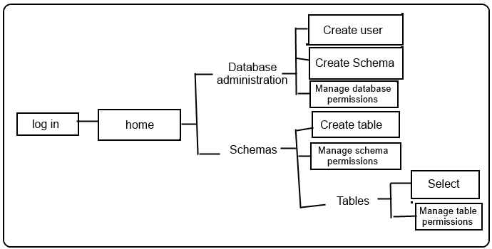

# postgresql_online_administration

Spécifications techniques

## IHM



Chaque page possède des boutons cliquables pour naviguer entre les pages et des formulaires pour remplir les paramètres des différentes fonctionnalités.

## Choix technique

Interface web
- Client HTML & CSS
- Server PHP

## PDO instance

- host = localhost
- dbname = test

```php
$PDO = new PDO('pgsql:host=localhost;dbname=test', $user, $password);
```

## Commandes SQL
```sql

--Create new user
CREATE USER 'user' WITH ENCRYPTED PASSWORD 'password';

--Create new schema
CREATE SCHEMA IF NOT EXISTS 'schema';

--Create new table
CREATE TABLE IF NOT EXISTS 'schema.table' (id SERIAL PRIMARY KEY);

--Manage user's database privileges
ALTER ROLE 'user' CREATEROLE (CREATEDB | NOCREATEDB);

ALTER ROLE 'user' WITH (SUPERUSER | NOSUPERUSER | REPLICATION | NOREPLICATION | BYPASSRLS | NOBYPASSRLS);

--Manage user's schema/table privileges
GRANT (USAGE | CREATE | SELECT | INSERT | UPDATE | DELETE) ON SCHEMA 'schema' TO 'user';

REVOKE (USAGE | CREATE | SELECT | INSERT | UPDATE | DELETE) ON SCHEMA 'schema' FROM 'user';

--Select user's schema/table privileges
SELECT
    pg_catalog.has_schema_privilege('user', 'schema', 'USAGE') AS use,
    pg_catalog.has_schema_privilege('user', 'schema', 'CREATE') AS create;

SELECT
    pg_catalog.has_table_privilege('user','schema.table', 'SELECT') AS select,
    pg_catalog.has_table_privilege('user','schema.table', 'INSERT') AS insert,
    pg_catalog.has_table_privilege('user','schema.table', 'UPDATE') AS update,
    pg_catalog.has_table_privilege('user','schema.table', 'DELETE') AS delete;

```